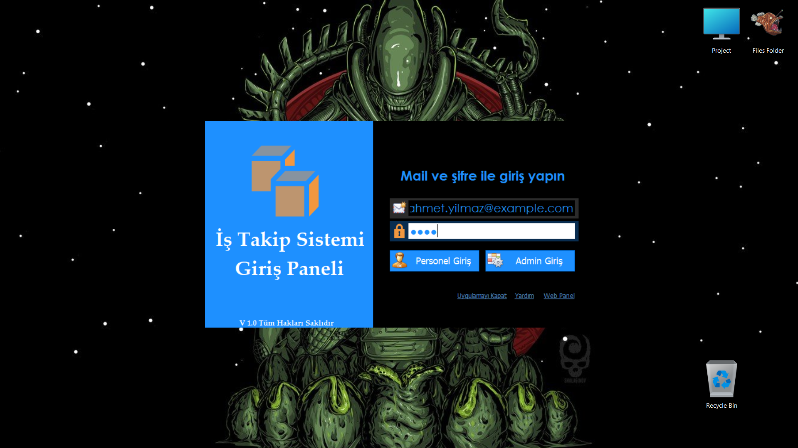
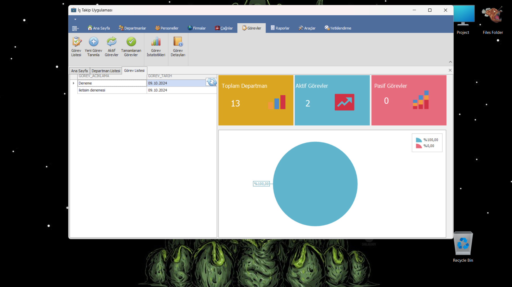

# Proje Açıklaması

Bu proje, C# programlama dili ve DevExpress bileşenleri kullanılarak geliştirilmiştir. Proje, veri tabanı yönetimi için Entity Framework'ü kullanarak veri erişimini sağlamaktadır. Kullanıcı arayüzü, DevExpress'in güçlü ve esnek kontrolleri ile tasarlanmış olup, kullanıcı deneyimini artırmak için görsel açıdan zengin bir deneyim sunmaktadır.

## Kullanılan Teknolojiler
- C#: Projenin temel programlama dili.
- DevExpress: Kullanıcı arayüzü tasarımı ve zengin kontroller için kullanıldı.
- Entity Framework: Veritabanı işlemleri ve ORM (Object-Relational Mapping) için kullanıldı.

